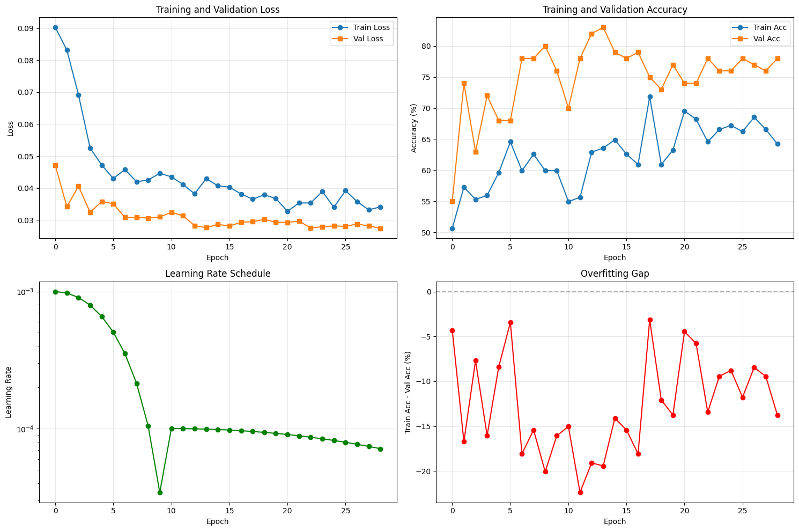
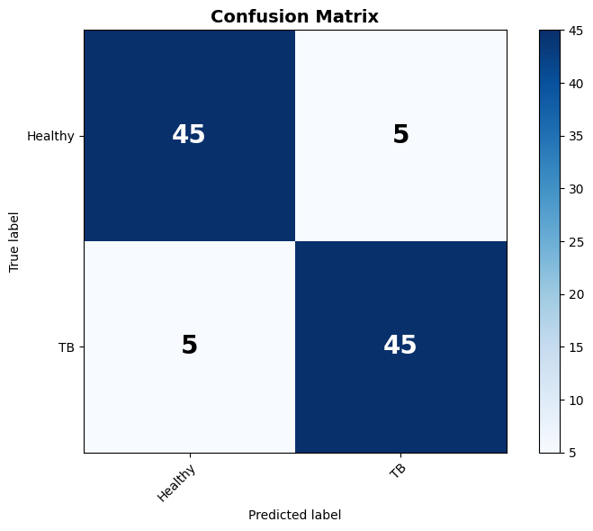

# Tuberculosis (TB) Detection from Chest X-Rays 🩻


## 📋 Project Overview

This project implements an advanced deep learning pipeline to detect Tuberculosis (TB) from chest X-ray images. Utilizing **EfficientNet-B3** as the backbone, the model employs state-of-the-art techniques such as **Mixup Augmentation**, **Two-Phase Training**, and **Test-Time Augmentation (TTA)** to achieve high diagnostic accuracy.

The system is designed to distinguish between **Healthy** and **TB-positive** scans with a focus on minimizing false negatives (high sensitivity).

---

## 🚀 Key Features

* **Architecture:** EfficientNet-B3 (Transfer Learning from ImageNet).
* **Data Augmentation:** "Mixup" strategy to improve generalization and robustness.
* **Training Strategy:**
    1.  **Phase 1:** Frozen backbone training to adapt the classifier head.
    2.  **Phase 2:** Fine-tuning the entire network with a lower learning rate.
* **Inference:** Test-Time Augmentation (TTA) to boost prediction reliability.
* **Visualization:** Comprehensive plotting of loss/accuracy curves and confusion matrices.

---

## 📊 Performance Results

The model was evaluated on a validation set of 100 samples. The use of Test-Time Augmentation (TTA) significantly improved performance by **+7.00%** over standard inference.

| Metric | Standard Evaluation | **TTA Evaluation** |
| :--- | :--- | :--- |
| **Accuracy** | 83.00% | **90.00%** |
| **Sensitivity (TB)** | 84.00% | **90.00%** |
| **Specificity (Healthy)** | 82.00% | **90.00%** |
| **ROC AUC** | 0.9172 | **0.9564** |

### Training Dynamics
The training process involved a learning rate schedule that decayed over time, preventing overfitting while ensuring convergence.


*Figure 1: Training metrics showing Loss, Accuracy, Learning Rate Schedule, and the Overfitting Gap.*

### Confusion Matrix
The final model achieves a balanced classification performance, correctly identifying 45/50 Healthy cases and 45/50 TB cases.


*Figure 2: Confusion Matrix validating the 90% accuracy with balanced False Positives and False Negatives.*

---

## 🛠️ Installation & Setup

### Prerequisites
* Python 3.8+
* PyTorch, Torchvision
* Matplotlib, Scikit-learn, Numpy, Pandas
* Albumentations (for augmentation)

### 1. Clone the Repository
```bash
git clone [https://github.com/yourusername/tb-detection-xray.git](https://github.com/yourusername/tb-detection-xray.git)
cd tb-detection-xray
